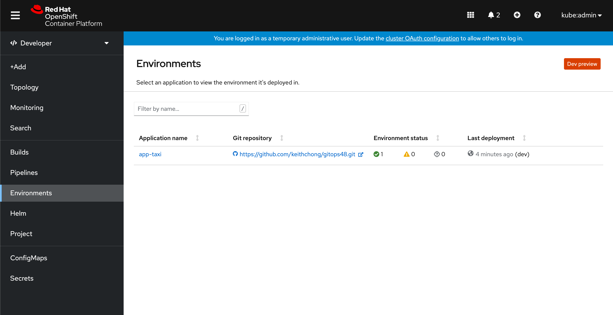
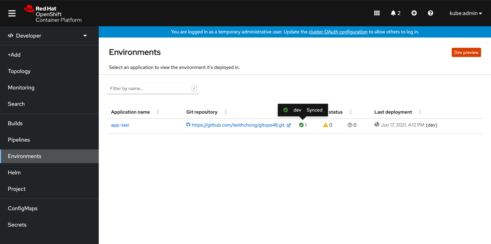
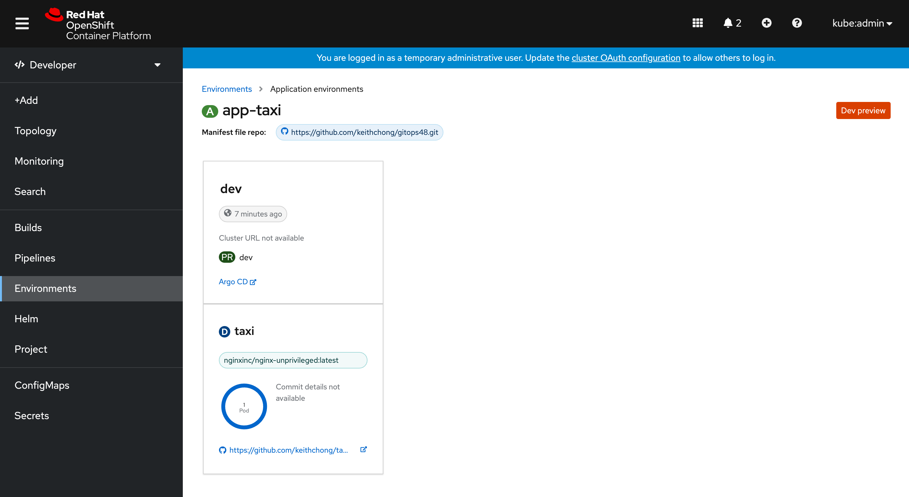

# GitOps Setup on DevConsole

Visualize your GitOps environment stages and applications on DevConsole in OpenShift 4.8


1. Follow the [Day 1 Operations](../journey/day1) and make sure your Argo CD applications are in sync.


2. Install the GitOps Service operator from OperatorHub in all-namespaces.


3. The operator will install the GitOps backend service in `openshift-gitops` namespace. `Environments` nav-item will be visible on the availability of the operator.


4. Select the `Environments` nav-item. The Environments page will immediately show the list of applications.



5. Hover over the icons under the Environment status column to see the sync status of all the environments.



6. Create a namespace by following the naming conventions.
```shell
$ kubectl create namespace pipelines-{console_username}-github
```
7. Create a secret for your git access token in the above namespace.
```shell
$ kubectl create secret -n pipelines-{console_username}-github generic {console_username}-github-token --from-literal=token={user-token}
```

8. The above two steps are necessary to enable the details page. Clicking on the application name will take you to the application details page.




Follow [Day 2 Operations](../journey/day2) to add more environments and applications to your GitOps workflow.