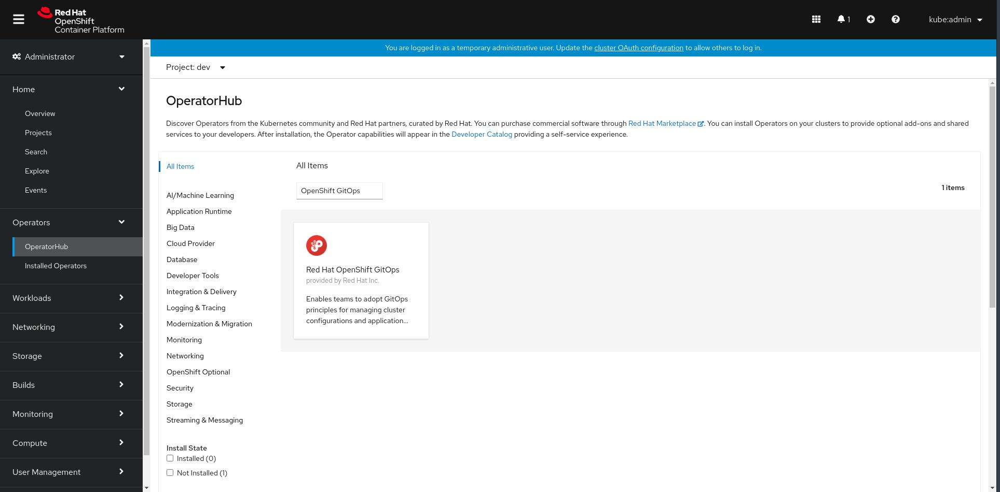
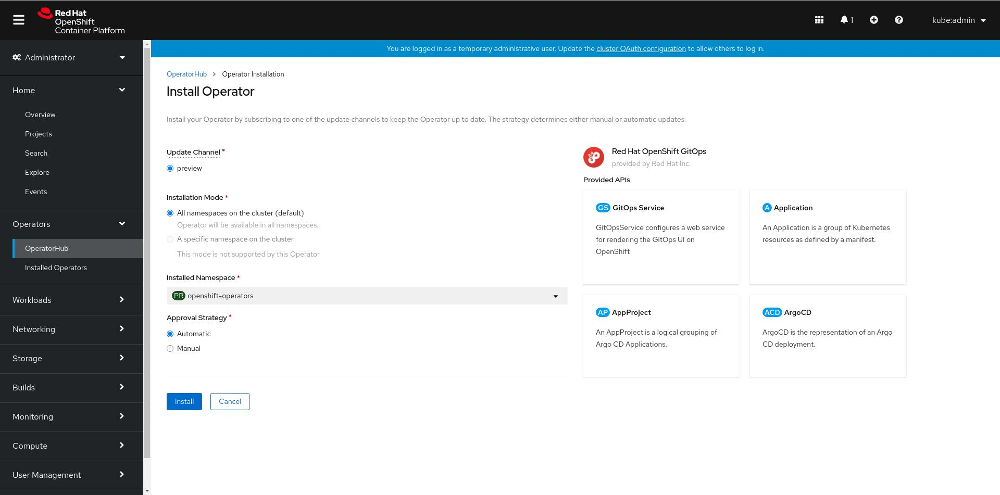
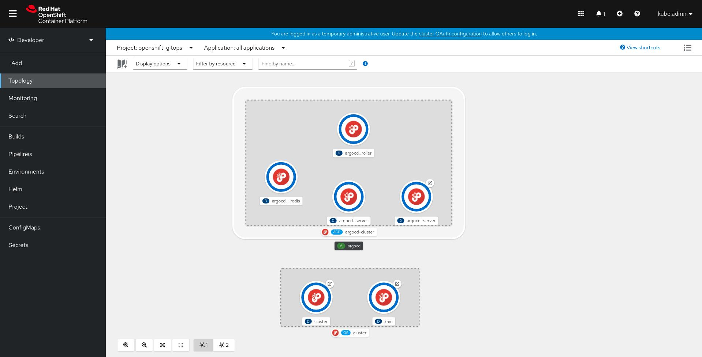
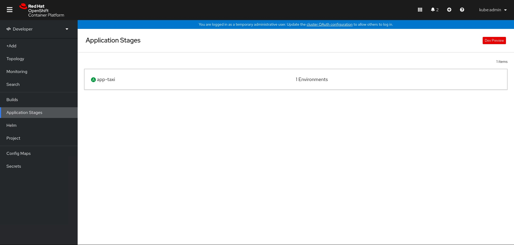

# GitOps Setup on DevConsole

Visualize your GitOps environment stages and applications on DevConsole in OpenShift 4.6


1. Follow the [Day 1 Operations](../journey/day1) and make sure your ArgoCD applications are in sync.


2. Install the GitOps Service operator from OperatorHub in all-namespaces.





3. The operator will install the GitOps backend service in `openshift-gitops` namespace(`openshift-pipelines-app-delivery` in case of a 4.6 cluster). `Application Stages` nav-item will be visible on the availability of the operator.



4. Create a namespace by following the naming conventions.
```shell
$ kubectl create namespace pipelines-{console_username}-github
```
5. Create a secret for your git access token in the above namespace.
```shell
$ kubectl create secret -n pipelines-{console_username}-github generic {console_username}-github-token --from-literal=token={user-token}
```

6. Application Stages should now be populated with the list of applications.



7. Clicking on an application will take you to the application details page.


Follow [Day 2 Operations](../journey/day2) to add more environments and applications to your GitOps workflow.