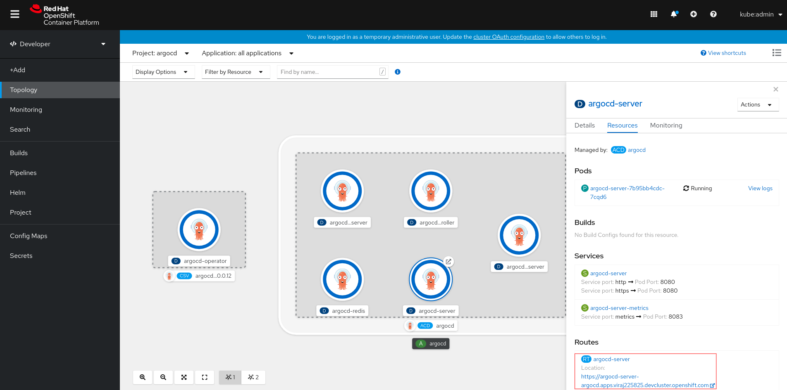
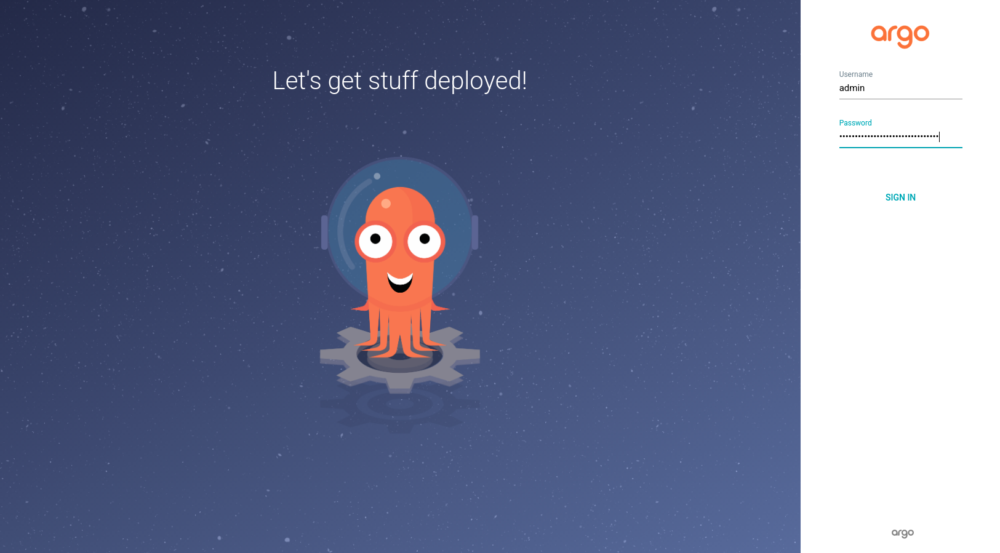
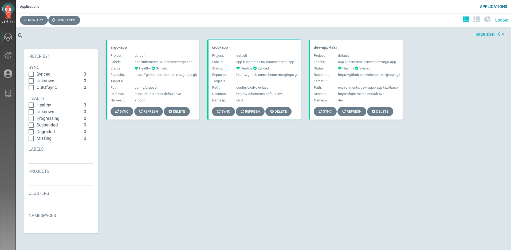

# Day 1 Operations

Day 1 Operations are actions that users take to bootstrap a GitOps
configuration.

Bootstrapping GitOps can be done with this command:

* [kam bootstrap](../../commands/kam_bootstrap.md)

The `kam bootstrap` command generates a functional GitOps setup including your first application.

This document describes how to bootstrap GitOps to deliver your first application.

You need to have the following installed in the OCP 4.x cluster.

* [OpenShift GitOps Operator](prerequisites/gitops_operator.md)
* [Sealed Secrets Operator](prerequisites/sealed_secrets.md)

And, you will need these:

* An application source repository ([taxi](prerequisites/service_repo.md) is used as an example in this document)
* The external image repository secret to authenticate image pushes on successful pipeline execution. To use quay.io, please follow [prerequisites/quay.md](prerequisites/quay.md)
* The official [kam](https://github.com/redhat-developer/kam/releases) binary downloaded
* A GitHub or GitLab access token (here are the steps to create the git access token for [GitHub](prerequisites/github_access_token_steps.md) or [GitLab](prerequisites/gitlab_access_token_steps.md))
* An SSH key connected to your GitHub or GitLab account (here are the steps to create an SSH key for [GitHub](https://docs.github.com/en/github/authenticating-to-github/adding-a-new-ssh-key-to-your-github-account) or [GitLab](https://docs.gitlab.com/ee/ssh/#generate-an-ssh-key-pair))

## Bootstrapping the Manifest

```shell
$ kam bootstrap \
  --service-repo-url https://github.com/<your organization>/taxi.git \
  --gitops-repo-url https://github.com/<your organization>/gitops.git \
  --image-repo quay.io/<username>/<image-repo> \
  --dockercfgjson ~/Downloads/<username>-auth.json \
  --git-host-access-token <your git access token> \
  --output <path to write GitOps resources>
  --push-to-git=true
```
The `kam bootstrap` [command](../../commands/kam_bootstrap.md) also provides an interactive mode, which is triggered by running without any parameters, or by providing the `--interactive` flag, and will generate the GitOps directory and the required resources.

During an interactive mode session, choose to use default values or not. If default values are chosen, prompts will appear to allow you to enter any required values that haven't already been provided from the command line. This is the quickest way to generate a bootstrapped GitOps configuration.
If you choose not to use defaults, you will be prompted to provide the values for each flag, except those flags that you have overridden or specified from the command line.

In the event of using a self-hosted _GitHub Enterprise_ or _GitLab Community/Enterprise Edition_ if the driver name isn't evident from the repository URL, use the `--private-repo-driver` flag to select _github_ or _gitlab_.

For more details see the [ArgoCD documentation](https://argoproj.github.io/argo-cd/user-guide/private-repositories).

The bootstrap process generates a fairly large number of files, including a
`pipelines.yaml` describing your first application, and configuration for a
complete CI pipeline and deployments from ArgoCD.

A `pipelines.yaml` file (example below) is generated by the `kam bootstrap` command.
This file is used by Day 2 commands such as `kam service add` to generate/update
pipelines resources.

The bootstrap process creates two environments: `dev` and `stage`

Namespaces are generated for both of these environments.

The name of the app and service is derived from the last component of your
`service-repo-url` e.g. if you bootstrap with `--service-repo-url
https://github.com/myorg/myproject.git` this would bootstrap an app called
`app-myproject` and a service called `myproject`.

Finally, the GitOps repository is created automatically if credentials are
provided, this will create a private repository for pushing your generated
resources, and the resources will be pushed to your git hosting service.

## Access Tokens

* The token is stored securely on the local filesystem using keyring. The keyring requires a username and service name to store the secret, the KAM tool stores the secret with the service name `Kam` and the username being the `host name` of the pertaining URL (e.g. --gitops-repo-url).

* If the token is set within the keyring, the keyring will not be prompted for in sucessive attempts of the `Bootstrap` and `Webhook` commands. The token can however be updated at the time of bootstrap in the keyring by passing the `--save-token-keyring` flag along with `--git-host-access-token` flag in the non-interactive mode of the bootstrap command.

* When a token is not provided in the command flag, an attempt is made to retrieve the token from the keyring. If unsuccessful, the cmd will look for the access token in an environment variable whose variable naming convention is as follows: The hostname (e.g. github.com) is extracted from the value passed to the repository URL (e.g. https://github.com/username/repo.git),  where the `.` in the hostname is replaced by `_` and concatenated with `_TOKEN`. In this case, the environment varaible name will be `GITHUB_COM_TOKEN`.

* In the event a token is not passed in the command, if the token is not found in the keyring or the environment variable with the specified name, the command will fail.

## Private Repository

In case a [private repository](https://argoproj.github.io/argo-cd/user-guide/private-repositories) is used, enhance the operator generated ArgoCD instance with the secret information how to connect to the git repos. 
For example, this could be as follows:

```yaml
apiVersion: argoproj.io/v1alpha1
kind: ArgoCD
metadata:
  creationTimestamp: null
  name: argocd
  namespace: openshift-gitops
spec:
  resourceExclusions: |
    - apiGroups:
      - tekton.dev
      clusters:
      - '*'
      kinds:
      - TaskRun
      - PipelineRun
  dex:
    image: quay.io/redhat-cop/dex
    openShiftOAuth: true
    version: v2.22.0-openshift
  rbac:
    defaultPolicy: 'role:readonly'
    policy: |
      g, system:cluster-admins, role:admin
    scopes: '[groups]'
  server:
    route:
      enabled: true
  repositoryCredentials: |
    - url: https://github.com/<your organization>/gitops.git
      passwordSecret:
        name: <a-secret-name>
        key: password
      usernameSecret:
        name: <a-secret-name>
        key: username

```

This `ArgoCD` resource defines a repository credential referring a `Secret` (here: `<a-secret-name>`).
To create the secret using `kubeseal` use the following commands (expecting the same access token as used with `--git-host-access-token`)

```bash
$ echo -n "token" | kubectl create secret generic <a-secret-name> --dry-run=true --from-file=username=/dev/stdin -o json | kubeseal -n openshift-gitops --controller-name=sealedsecretcontroller-sealed-secrets --controller-namespace=cicd > argocd-repo-secret.json

$ echo -n "<your git access token>" | kubectl create secret generic <a-secret-name> --dry-run=true --from-file=password=/dev/stdin -o json | kubeseal -n openshift-gitops --controller-name=sealedsecretcontroller-sealed-secrets --controller-namespace=cicd --merge-into argocd-repo-secret.json

$ oc apply -f argocd-repo-secret.json
sealedsecret.bitnami.com/<a-secret-name> created
```

Consider here the following configuration parameters

* set the namespace where ArgoCD is running (here: `openshift-gitops`)
* set the SealedSecret namespace and service name (here: `cicd` and `sealedsecretcontroller-sealed-secrets`)

## Prefixing namespaces

By default, bootstrapping creates `cicd`, `dev`, and `stage` namespaces, these
can be optionally prefixed by passing `--prefix` to the `kam bootstrap` command.

This is useful if you're working in a shared cluster, for example, with 
`--prefix tst`, the command will generate 3 namespaces called: `tst-cicd`, `tst-dev` and
`tst-stage`.

## Environment configuration

The `dev` environment is a very basic deployment

### configuring pipelines

```yaml
config:
  argocd:
    namespace: openshift-gitops
  pipelines:
    name: cicd
environments:
- apps:
  - name: app-taxi
    services:
    - name: taxi
      pipelines:
        integration:
          bindings:
          - dev-app-taxi-taxi-binding
          - gitlab-push-binding
      source_url: https://github.com/<your organization>/taxi.git
      webhook:
        secret:
          name: webhook-secret-dev-taxi
          namespace: cicd
  name: dev
  pipelines:
    integration:
      bindings:
      - gitlab-push-binding
      template: app-ci-template
- name: stage
gitops_url: https://github.com/<your organization>/gitops.git
version: 1
```

The `pipelines` key describes how to trigger an OpenShift Pipelines run, the
`integration` binding and template are processed when a _Pull Request_
is opened.

This is the default pipeline specification for the `dev` environment, you
can find the definitions for these in these two files:

 * `config/cicd/base/07-templates/app-ci-build-from-push-template.yaml`
 * `config/cicd/base/06-bindings/github-push-binding.yaml`

By default, this triggers a `PipelineRun` of this pipeline

 * `config/cicd/base/05-pipelines/app-ci-pipeline.yaml`

These files are not managed directly by the manifest, you're free to change them
for your own needs, by default they use [Buildah](https://github.com/containers/buildah)
to trigger build, assuming that the Dockerfile for your application is in the root
of your repository.

### configuring services

```yaml
- apps:
  - name: app-taxi
    services:
    - name: taxi
      pipelines:
        integration:
          bindings:
          - dev-app-taxi-taxi-binding
          - gitlab-push-binding
      source_url: https://github.com/<your organization>/taxi.git
      webhook:
        secret:
          name: webhook-secret-dev-taxi
          namespace: cicd
```

The YAML above defines an app called `app-taxi`, which has a reference to a service called `taxi`.

The configuration for these is written out to:

 * `environments/dev/apps/app-taxi/services/taxi/base/config/`

The `app-taxi` app's configuration references the services configuration.

The `source_url` references the source code repository for the service.

The `pipelines` field describes the templates and bindings used for this service.

The`webhook.secret` is used to authenticate incoming hooks from Git host.

## Argo CD Permissions

By default, kam provides admin privileges to Argo CD application controller service account. For each environment
managed by kam, a rolebinding file is generated, that makes Argo CD an admin in that environment. In order to modify it, 
update the argocd-admin rolebinding file

* `environments/<name>/env/base/argocd-admin.yaml`

## Bringing the bootstrapped environment up

First of all, let's get started with our Git repository.

From the root of your GitOps directory (with the pipelines.yaml), execute the
following commands:

```shell
$ git init .
$ git add .
$ git commit -m "Initial commit."
$ git remote add origin <insert gitops repo>
$ git push -u origin main
```

This will initialize the GitOps repository and is the start of your journey
to deploying applications via Git.

## Bringing the deployment infrastructure up

We'll bring up our deployment infrastructure, this is only necessary at the start.
The configuration will be self-hosted thereafter.

```shell
$ oc apply -k config/argocd/
```

At this point, the apps in ArgoCD should be synced and healthy. You may need to manually ["sync apps"](https://github.com/argoproj/argo-cd/blob/master/docs/getting_started.md#7-sync-deploy-the-application) from the ArgoCD web UI if some of the apps are out-of-sync. Instructions on how to access the ArgoCD web UI is provided in the next section.  

A route is automatically created, which will serve the default image. This is
automatically created based on the name of your application source repository.

## Visualize your applications via the ArgoCD UI

Open the ArgoCD web UI from `argocd-server` route



Get your login credentials from the cluster

```shell
$ kubectl get secret argocd-cluster-cluster -n openshift-gitops -ojsonpath='{.data.admin\.password}' | base64 -d
```

You can now login with username as `admin` and password fetched in the previous step:



The deployed applications should be healthy and in-sync



## Changing the initial deployment

The bootstrap creates a `Deployment` in `environments/dev/apps/<app name>/services/<service name>/base/config/100-deployment.yaml`. This should bring up nginx, and is purely for demo purposes, you'll need to change this to deploy your built image.

```yaml
spec:
  containers:
  - image: nginxinc/nginx-unprivileged:latest
    imagePullPolicy: Always
    name: taxi
```

You'll want to replace this with the image for your application, once you've
built and pushed it.

## Your first CI run

Part of the configuration bootstraps a simple OpenShift Pipelines pipeline for
building code when a pull-request is opened.

You will need to create a new webhook for your Git hosting service, this is used
to trigger pipeline runs automatically on pushes to your repositories.

```shell
$ kam webhook create \
    --git-host-access-token <git host access token> \
    --env-name dev \
    --service-name taxi
```

Note: If the webhook creation fails with _gitops-webhook-event-listener-route_ route not being present, login to the ArgoCD UI to verify if the apps have been created and synced successfully (instructions on how to access the ArgoCD UI is at the bottom of this guide)

Make a change to your application source, the `taxi` repo from the example, it
can be as simple as editing the `README.md` and propose a change as a
Pull Request.

This should trigger the PipelineRun:


Drilling into the PipelineRun we can see that it executed our single task:


And finally, we can see the logs that the build completed and the image was
pushed:


## Changing the default CI run

Before this next stage, we need to ensure that there's a webhook configured for
the GitOps repo.

```shell
$ kam webhook create \
    --git-host-access-token <github user access token> \
    --cicd
```

This step involves changing the CI definition for your application code.

The default CI pipeline we provide is defined in the manifest file:

```yaml
  pipelines:
    integration:
      bindings:
      - github-push-binding
      template: app-ci-template
```

This template drives a pipeline that is stored in this file:

 * `config/cicd/base/05-pipelines/app-ci-pipeline.yaml`

An abridged version is shown below, it has a single task `build-image`, which
executes the `buildah` task, which builds the source and generates an
image and pushes it to your image-repo.

```yaml
apiVersion: tekton.dev/v1alpha1
kind: Pipeline
spec:
  resources:
  - name: source-repo
    type: git
  tasks:
  - name: build-image
      inputs:
      - name: source
        resource: source-repo
    taskRef:
      kind: ClusterTask
      name: buildah
```

You will likely want to add additional tasks for running the tests for your
application code.

Write the following Task to this file:

 * `config/cicd/base/04-tasks/go-test-task.yaml`

```yaml
apiVersion: tekton.dev/v1beta1
kind: Task
metadata:
  name: go-test
  namespace: default
spec:
  resources:
    inputs:
      - name: source
        type: git
  steps:
    - name: go-test
      image: golang:latest
      command: ["go", "test", "./..."]
```

This is a simple test task for a Go application, it just runs the tests.

Append the newly added task to the existing kustomize file

* `config/cicd/base/kustomization.yaml`

Update the pipeline in this file:

 * `config/cicd/base/05-pipelines/app-ci-pipeline.yaml`

```yaml
apiVersion: tekton.dev/v1beta1
kind: Pipeline
metadata:
  creationTimestamp: null
  name: app-ci-pipeline
  namespace: cicd
spec:
  params:
  - name: REPO
    type: string
  - name: COMMIT_SHA
    type: string
  resources:
  - name: source-repo
    type: git
  - name: runtime-image
    type: image
  tasks:
  - name: go-ci
    resources:
      inputs:
      - name: source
        resource: source-repo
    taskRef:
      kind: Task
      name: go-test
  - name: build-image
    runAfter:
      - go-ci
    params:
    - name: TLSVERIFY
      value: "true"
    resources:
      inputs:
      - name: source
        resource: source-repo
      outputs:
      - name: image
        resource: runtime-image
    taskRef:
      kind: ClusterTask
      name: buildah
```

Commit and push this code, and open a Pull Request, you should see a `PipelineRun`
being executed.


This validates that the YAML can be applied, by executing `oc apply -k --dry-run`.
