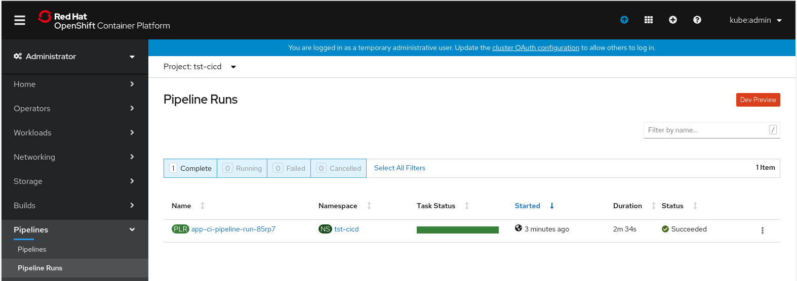
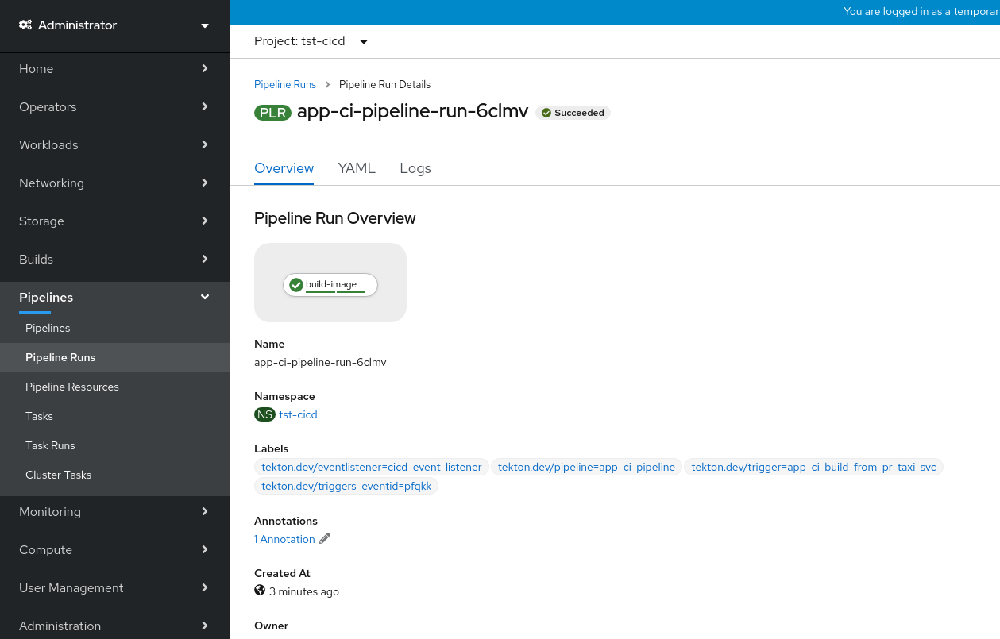
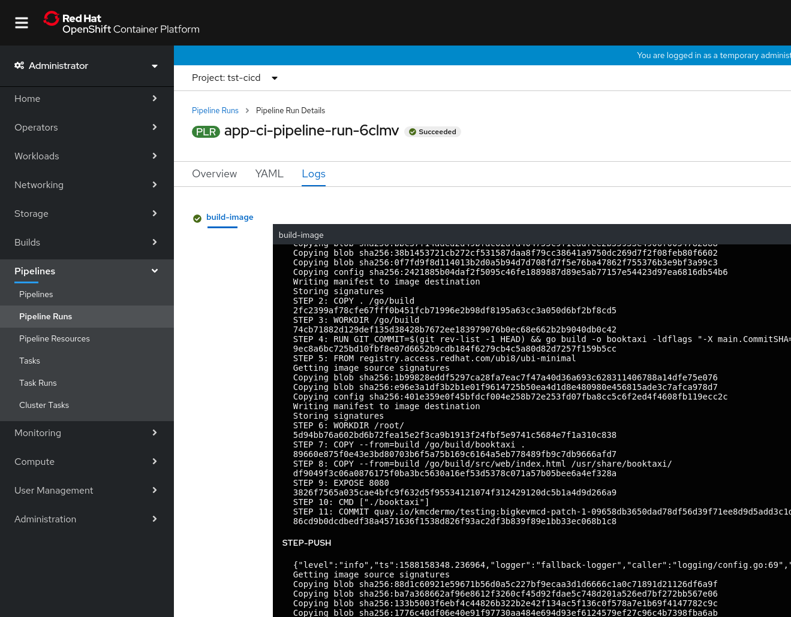
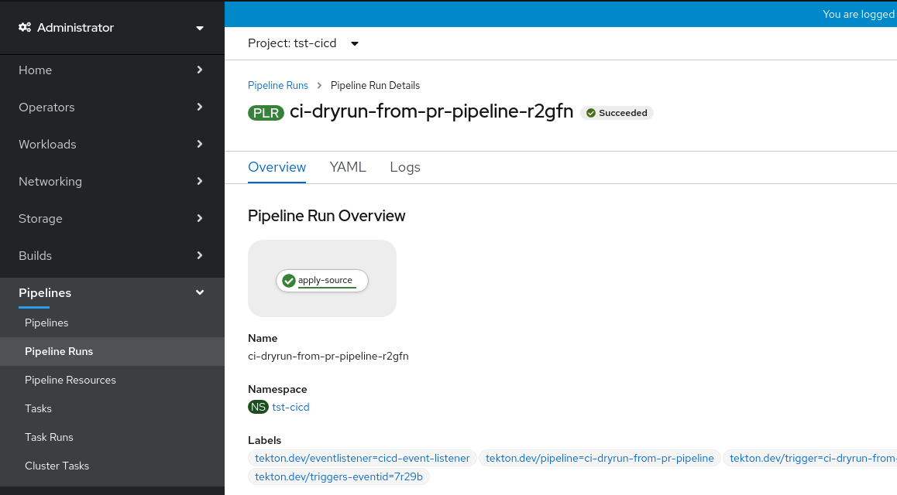

e Day 1 Operations

Day 1 Operations are actions that users take to bootstrap a GitOps
configuration.

Bootstrapping GitOps can be done with this command:

* [gitops bootstrap](../../commands/bootstrap)

The bootstrap command generates a functional GitOps setup including your first application.

This document describes how to bootstrap GitOps to deliver your first application.

You need to have the following installed in the OCP 4.x cluster.

* [Sealed Secrets Operator](prerequisites/sealed_secrets.md)
* [OpenShift Pipelines Operator](prerequisites/pipelines_operator.md)
* [ArgoCD](prerequisites/argocd.md)

And, you will need this.

* Create your [GitOps repository](prerequisites/gitops_repo.md)
* Application Source repository ([taxi](prerequisites/service_repo.md) is used as an example in this document)
* The external image repository secret to authenticate image pushes on sucessfull pipeline execution. To use quay.io, please follow [prerequisites/quay.md](prerequisites/quay.md)
* Download official [gitops](https://github.com/redhat-developer/gitops-cli/releases) binary
* Steps to create the git access token for [GitHub](prerequisites/github_access_token_steps.md) or [GitLab](prerequisites/gitlab_access_token_steps.md).

## Bootstrapping the Manifest

```shell
$ gitops bootstrap \
  --service-repo-url https://github.com/<username>/taxi.git \
  --gitops-repo-url https://github.com/<username>/gitops.git \
  --image-repo quay.io/<username>/<image-repo> \
  --dockercfgjson ~/Downloads/<username>-auth.json \
  --output <path to write GitOps resources>
```
Executing the above command will generate the GitOps directory and the required resources.

In the event of using a self-hosted _GitHub Enterprise_ or _GitLab Community/Enterprise Edition_ if the driver name isn't evident from the repository URL. Use the `--private-repo-driver` flag to select _github_ or _gitlab_.

For more details see the [ArgoCD documentation](https://argoproj.github.io/argo-cd/user-guide/private-repositories).

The bootstrap process generates a fairly large number of files, including a
`pipelines.yaml` describing your first application, and configuration for a
complete CI pipeline and deployments from ArgoCD.

A pipelines.yaml file (an example below) is generated by `bootstrap` command.
This file is used by Day 2 commands such as `service add` to generate/update
pipelines resources.

The bootstrap creates two environments, `dev`, and `stage`

Namespaces are generated for both of these environments.

The name of the app and service are derived from the last component of your
`service-repo-url` e.g. if you bootstrap with `--service-repo-url
https://github.com/myorg/myproject.git` this would bootstrap an app called
`app-myproject` and a service called `myproject`.

## Environment configuration

The `dev` environment is a very basic deployment

### configuring pipelines

```yaml
config:
  argocd:
    namespace: argocd
  pipelines:
    name: cicd
environments:
- apps:
  - name: app-taxi
    services:
    - name: taxi
      pipelines:
        integration:
          bindings:
          - dev-app-taxi-taxi-binding
          - gitlab-push-binding
      source_url: https://github.com/rhd-gitops-example/taxi.git
      webhook:
        secret:
          name: webhook-secret-dev-taxi
          namespace: cicd
  name: dev
  pipelines:
    integration:
      bindings:
      - gitlab-push-binding
      template: app-ci-template
- name: stage
gitops_url: https://github.com/<your organization>/<your repository>
version: 1
```

The `pipelines` key describes how to trigger an OpenShift Pipelines run, the
`integration` binding and template are processed when a _Pull Request_
is opened.

This is the default pipeline specification for the `dev` environment, you
can find the definitions for these in these two files:

 * [`config/<prefix>-cicd/base/07-templates/app-ci-build-from-push-template.yaml`](output/config/cicd/base/07-templates/app-ci-build-from-push-template.yaml)
 * [`config/<prefix>-cicd/base/06-bindings/github-push-binding.yaml`](output/config/cicd/base/06-bindings/github-push-binding.yaml)

By default this triggers a PipelineRun of this pipeline

 * [`config/<prefix>-cicd/base/05-pipelines/app-ci-pipeline.yaml`](output/config/cicd/base/05-pipelines/app-ci-pipeline.yaml)

These files are not managed directly by the manifest, you're free to change them
for your own needs, by default they use [Buildah](https://github.com/containers/buildah)
to trigger build, assuming that the Dockerfile for your application is in the root
of your repository.

### configuring services

```yaml
- apps:
  - name: app-taxi
    services:
    - name: taxi
      pipelines:
        integration:
          bindings:
          - dev-app-taxi-taxi-binding
          - gitlab-push-binding
      source_url: https://github.com/rhd-gitops-example/taxi.git
      webhook:
        secret:
          name: webhook-secret-dev-taxi
          namespace: cicd
```

The YAML above defines an app called `app-taxi`, which has a reference to service called `taxi`.

The configuration for these is written out to:

 * [`environments/test-dev/services/taxi/base/config/`](output/environments/dev/apps/app-taxi/services/taxi/base/config)
 * [`environments/<prefix>-dev/apps/app-taxi/base/`](output/environments/dev/apps/app-taxi/base/)

The `app-taxi` app's configuration references the services configuration.

The `source_url` references the source code repository for the service.

The `pipelines` field describes the templates and bindings used for this service.

The`webhook.secret` is used to authenticate incoming hooks from GitHub.

## Bringing the bootstrapped environment up

First of all, let's get started with our Git repository.

From the root of your gitops directory (with the pipelines.yaml), execute the
following commands:

```shell
$ git init .
$ git add .
$ git commit -m "Initial commit."
$ git remote add origin <insert gitops repo>
$ git push -u origin master
```

This should initialize the GitOps repository, this is the start of your journey
to deploying applications via Git.

## Bring up Deployment Infrastructure

We'll bring up our deployment infrastructure, this is only necessary at the start,
the configuration should be self-hosted thereafter.

```shell
$ oc apply -k config/argocd/
```

You should now be able to create a route to your new service, it should be
running [nginx](https://nginx.org/) and serving a page.

## Changing the initial deployment

The bootstrap creates a `Deployment` in `environments/<prefix>-dev/services/<service name>/base/config/100-deployment.yaml` this should bring up nginx, this is purely for demo purposes, you'll need to change this to deploy your built image.

```yaml
spec:
  containers:
  - image: nginxinc/nginx-unprivileged:latest
    imagePullPolicy: Always
    name: taxi-svc
```

You'll want to replace this with the image for your application, once you've
built and pushed it.

## Your first CI run

Part of the configuration bootstraps a simple OpenShift Pipelines pipeline for
building code when a pull-request is opened.

You will need to create a new webhook for your Git hosting service, this is used
to trigger pipeline runs automatically on pushes to your repositories.

```shell
$ gitops webhook create \
    --access-token <github user access token> \
    --env-name tst-dev \
    --service-name taxi
```

Make a change to your application source, the `taxi` repo from the example, it
can be as simple as editing the `README.md` and propose a change as a
Pull Request.

This should trigger the PipelineRun:



Drilling into the PipelineRun we can see that it executed our single task:



And finally, we can see the logs that the build completed and the image was
pushed:



## Changing the default CI run

Before this next stage, we need to ensure that there's a webhook configured for
the "gitops" repo.

```shell
$ gitops webhook create \
    --access-token <github user access token> \
    --cicd
```

This step involves changing the CI definition for your application code.

The default CI pipeline we provide is defined in the manifest file:

```yaml
  pipelines:
    integration:
      bindings:
      - github-pr-binding
      template: app-ci-template
```

This template drives a Pipeline that is stored in this file:

 * [`config/<prefix>-cicd/base/05-pipelines/app-ci-pipeline.yaml`](output/config/cicd/base/05-pipelines/app-ci-pipeline.yaml)

An abridged version is shown below, it has a single task `build-image`, which
executes the `buildah` task, which basically builds the source and generates an
image and pushes it to your image-repo.

```yaml
apiVersion: tekton.dev/v1alpha1
kind: Pipeline
spec:
  resources:
  - name: source-repo
    type: git
  tasks:
  - name: build-image
      inputs:
      - name: source
        resource: source-repo
    taskRef:
      kind: ClusterTask
      name: buildah
```

You will likely want to add additional tasks for running the tests for your
application code.

Write the following Task to this file:

 * `config/<prefix>-cicd/base/04-tasks/go-test-task.yaml`

```yaml
apiVersion: tekton.dev/v1beta1
kind: Task
metadata:
  name: go-test
  namespace: tst-cicd
spec:
  inputs:
    resources:
    - name: source
      description: the git source to execute on
      type: git
  steps:
    - name: go-test
      image: golang:latest
      command: ["go", "test", "./..."]
```

This is a simple test task for a Go application, it just runs the tests.

Append the newly added task to the existing kustomize file

* [`config/<prefix>-cicd/base/kustomization.yaml`](output/config/cicd/base/kustomization.yaml)

Update the pipeline in this file:

 * [`config/<prefix>-cicd/base/05-pipelines/app-ci-pipeline.yaml`](output/config/cicd/base/05-pipelines/app-ci-pipeline.yaml)

```yaml
apiVersion: tekton.dev/v1beta1
kind: Pipeline
metadata:
  creationTimestamp: null
  name: app-ci-pipeline
  namespace: tst-cicd
spec:
  params:
  - name: REPO
    type: string
  - name: COMMIT_SHA
    type: string
  resources:
  - name: source-repo
    type: git
  - name: runtime-image
    type: image
  tasks:
  - name: go-ci
    resources:
      inputs:
      - name: source
        resource: source-repo
    taskRef:
      kind: Task
      name: go-test
  - name: build-image
    runAfter:
      - go-ci
    params:
    - name: TLSVERIFY
      value: "true"
    resources:
      inputs:
      - name: source
        resource: source-repo
      outputs:
      - name: image
        resource: runtime-image
    taskRef:
      kind: ClusterTask
      name: buildah
```

Commit and push this code, and open a Pull Request, you should see a PipelineRun
being executed.



This validates that the YAML can be applied, by executing a `kubectl apply --dry-run`.
