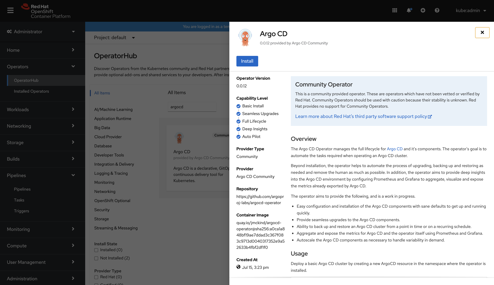

### ArgoCD Installation - with operator (Recommended)

Create argocd namespace to install the operator:

```shell
$ oc create namespace argocd
```

Click on the ArgoCD operator as shown below in the OperatorHub on your OpenShift console and install the operator in the argocd namespace.



Note: Due to an open [issue](https://github.com/argoproj-labs/argocd-operator/issues/107) the operator may not create enough privileges to manage multiple namespaces.

In order to solve this apply:

```shell
$ oc adm policy add-cluster-role-to-user cluster-admin system:serviceaccount:argocd:argocd-application-controller
```

When the pods are up, open the ArgoCD web UI by clicking on the created route  


Get your login credentials from the cluster

```shell
$ oc get secret argocd-cluster -n argocd -ojsonpath='{.data.admin\.password}' | base64 --decode
```

You can now login with username as `admin` and password fetched in the previous step:


