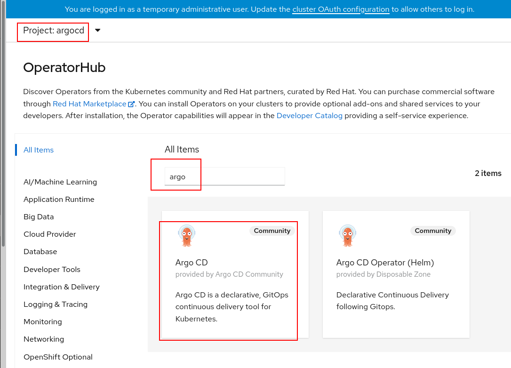
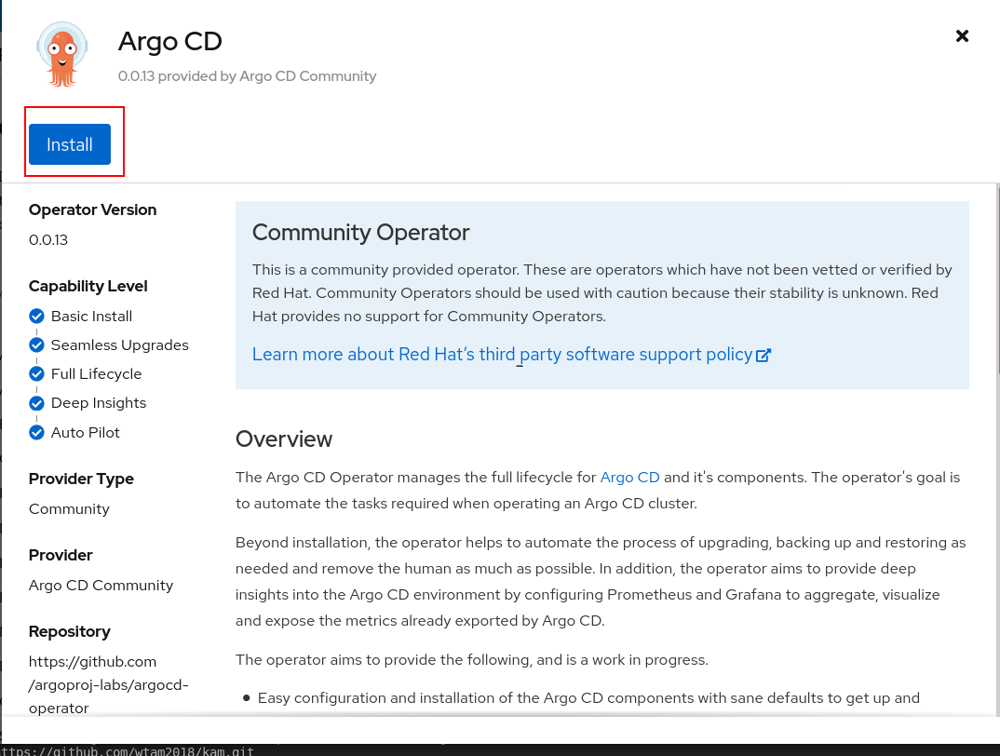
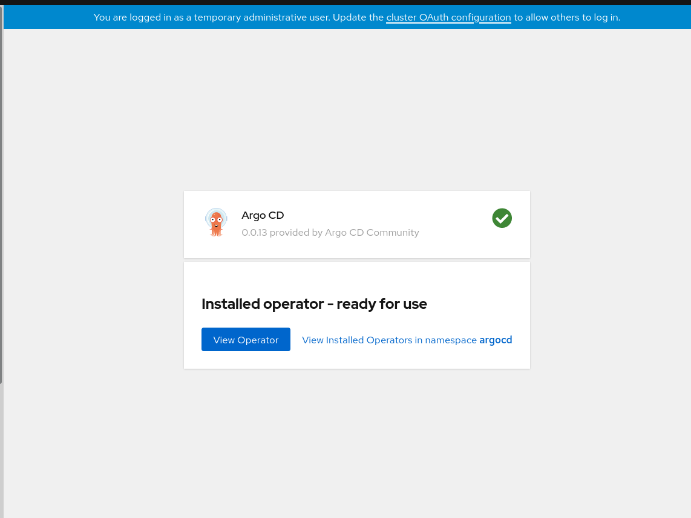

# ArgoCD Installation - with operator (Recommended)

There are three steps in this installation
* [create `argocd` namespace ](#Create-argocd-namespace)
* [nstall ArgoCD Operator](#install-ArgoCD-Operator)
* [Add Role Binding](#Add-Role-Binding)

## Create argocd namespace
Create argocd namespace to install the operator:

```shell
$ oc create namespace argocd
```

## Install ArgoCD Operator
Click on the ArgoCD operator as shown below in the OperatorHub on your OpenShift console and install the operator in the argocd namespace.









## Add Role Binding

Note: Due to an open [issue](https://github.com/argoproj-labs/argocd-operator/issues/107) the operator may not create enough privileges to manage multiple namespaces.

In order to solve this apply:

```shell
$ oc adm policy add-cluster-role-to-user cluster-admin system:serviceaccount:argocd:argocd-application-controller
```