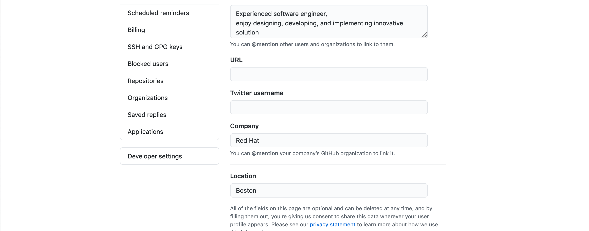
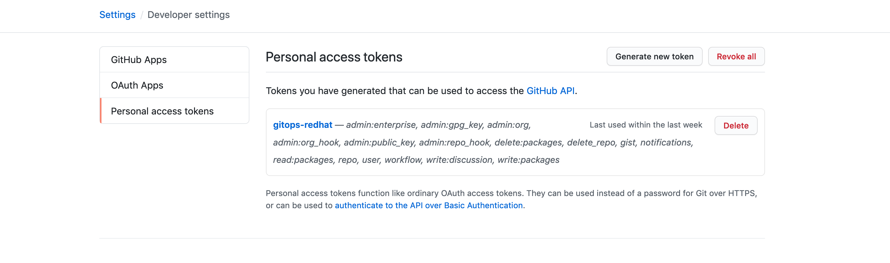

# How to retrieve the git access token.

#### First log into your github repository, and click on the developer settings. 

#### Click on the personal access token on the tab on your left.

#### If you already possess a token, click on the current token and regenerate the existing token, if not create a new token.

