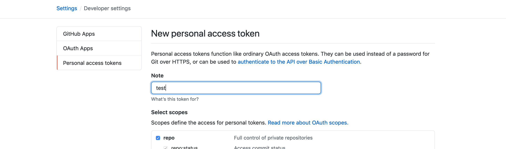

# How to retrieve a GitHub access token.

#### First log into your GitHub account, and click on the developer settings

#### Click on the personal access token on the tab on your left.

#### If you already possess a token, click on the current token and regenerate the existing token, if not create a new token.

