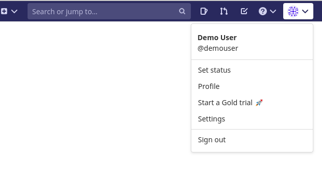
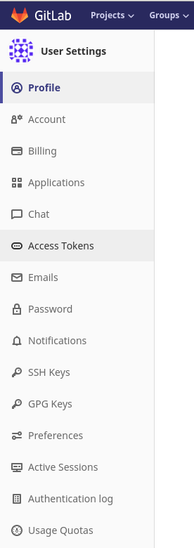
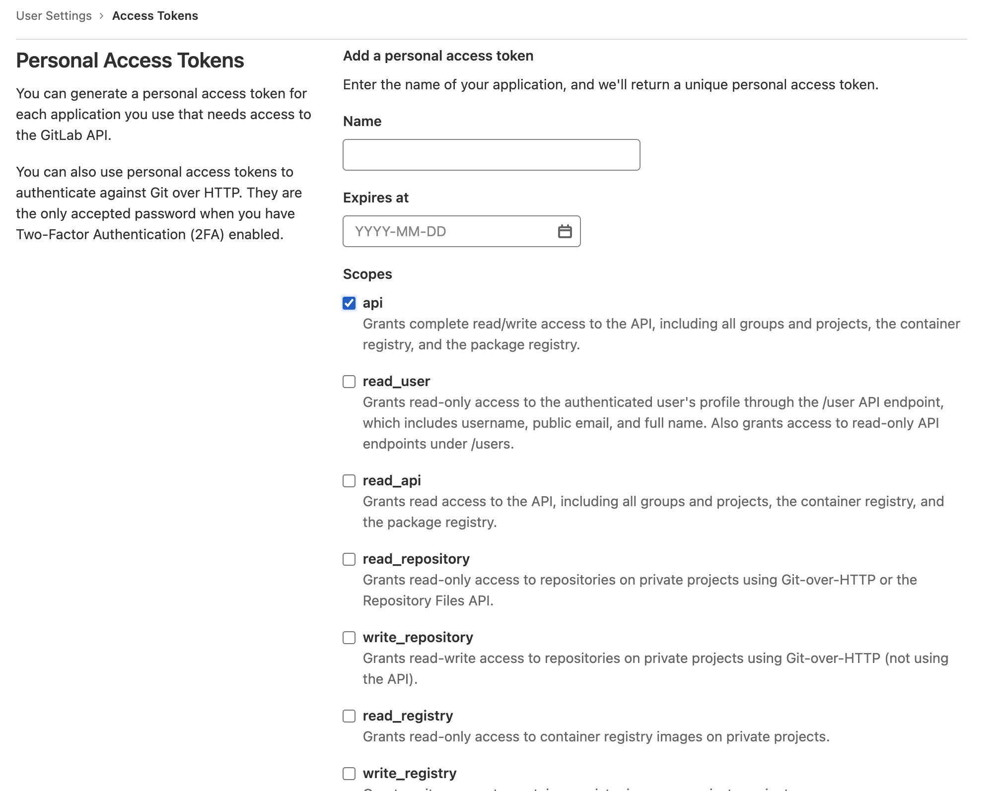

# How to retrieve a GitHub access token.

#### First log into your GitLab account, and click on the user menu.

#### Click on the "Access Tokens" item in the "User Settings" on your left.

#### If you already possess a token, click on the current token and regenerate the existing token, if not create a new token.

