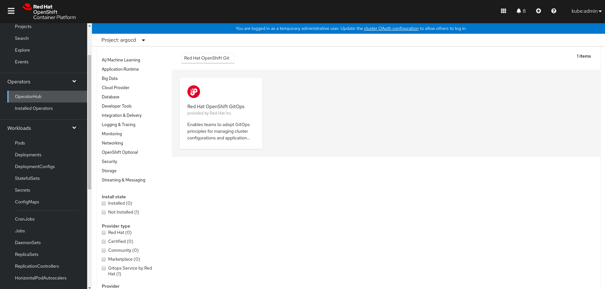
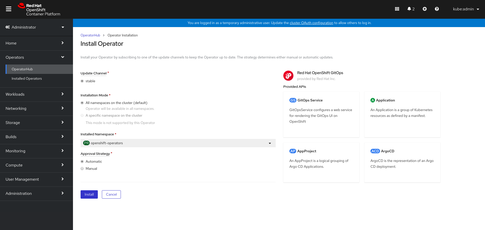

## Install OpenShift GitOps operator

Install OpenShift GitOps operator from OperatorHub which installs the following components

1. Argo CD instance in `openshift-gitops` namespace
2. OpenShift Pipelines Operator
3. GitOps Service in `openshift-gitops` namespace (`openshift-pipelines-app-delivery` in case of a 4.6 cluster)

Follow the installation wizard and deploy the operator with defaults.






## Add Role Binding

The operator may not create enough privileges to manage multiple namespaces. In order to solve this:

1. Provide cluster-admin access to argocd-application-controller service account.

```shell
$ oc adm policy add-cluster-role-to-user cluster-admin system:serviceaccount:openshift-gitops:argocd-application-controller
```

2. Provide custom privileges to `argocd-application-controller` service account and restrict access to argocd.

Example

```yaml
apiVersion: rbac.authorization.k8s.io/v1
kind: RoleBinding
metadata:
  name: application-controller
  namespace: <env> 
subjects:
- kind: ServiceAccount
  name: argocd-application-controller
  apiGroup: ""
roleRef:
  kind: Role
  name: <argocd-role>
  apiGroup: rbac.authorization.k8s.io
```