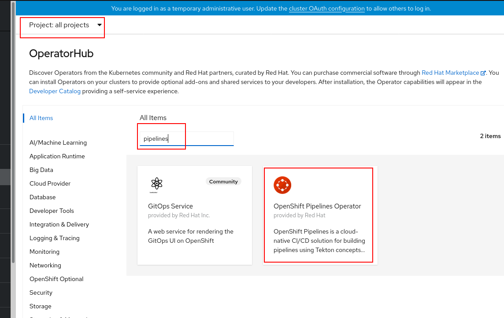
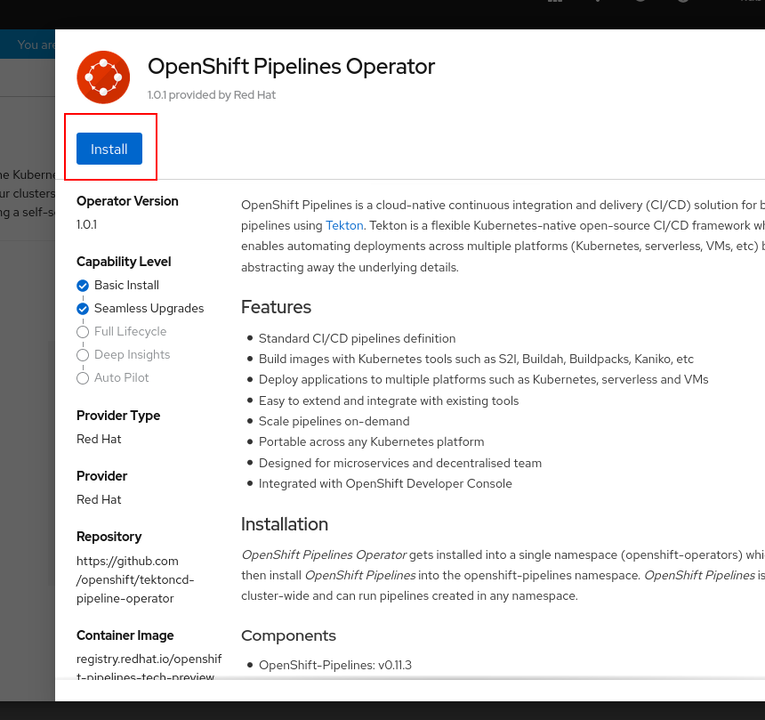
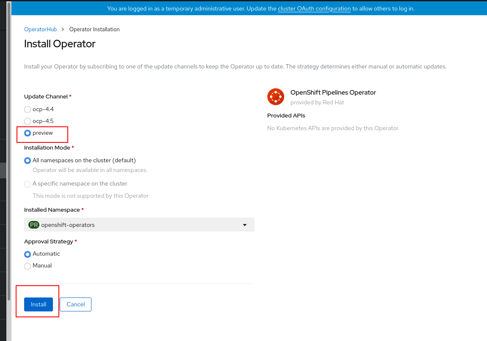
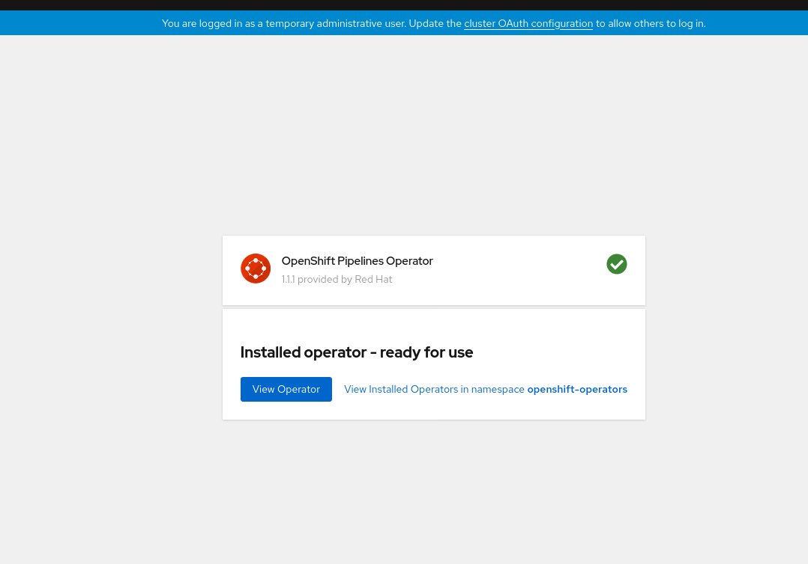

# OpenShift Operator and Builddah ClusterTask

There are two items to be installed
* [OpenShift Pipelines Operator](#Install-OpenShift-Pipelines-Operator)
* [Buildah ClusterTask](#Install-the-Buildah-ClusterTask)

## Install OpenShift Pipelines Operator

Login to OpenShift DevConsole and install Openshift Pipelines Operator

**NOTE:**
`Openshift Pipelines Operator` does not show up in OperatorHub?   OpenShift Pipelines Operator is not available in the “new bundle format” that was entered into 4.6 on Aug 3rd.  They are planning a 4.6 release on Oct 21st (the day before GA) which will add the Operator back (in the new bundle format) and thus become available again.  Please run the following command to install from command line.
```shell
$ oc apply -f https://gist.githubusercontent.com/praveen4g0/8b5b734aa5f8a6163d8490b297aacd26/raw/519c82b7de1e69fb63310fc92558ec7b849e8c8c/catalog-source.yaml
```
Otherwise, install OpenShift Pipelines Operator from OperatorHub.










## Install the Buildah ClusterTask

```shell
$ oc apply -f https://raw.githubusercontent.com/redhat-developer/kam/master/docs/updates/buildah.yaml
```


