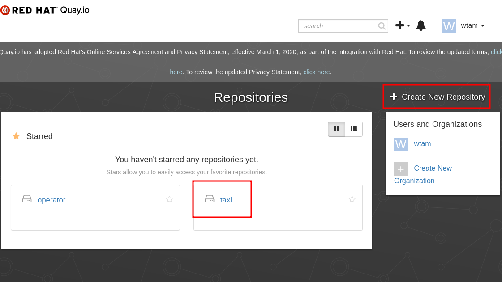
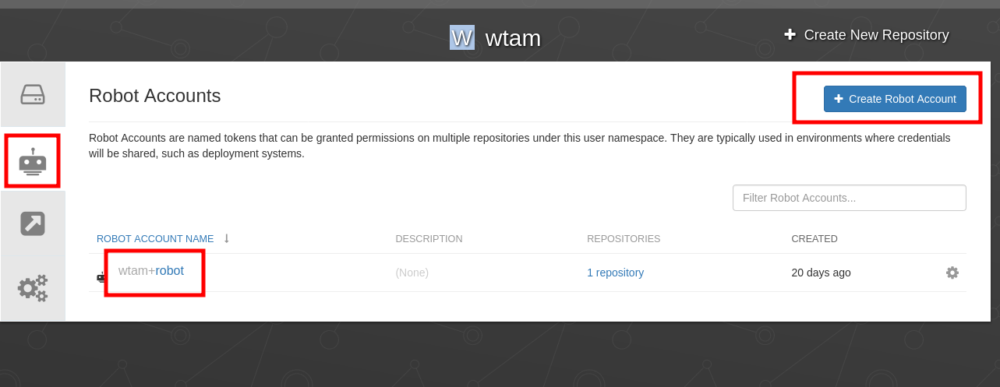
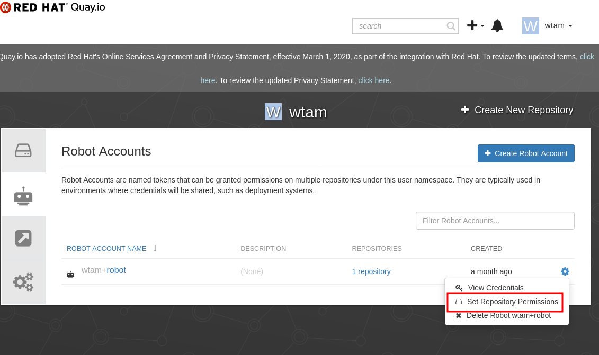
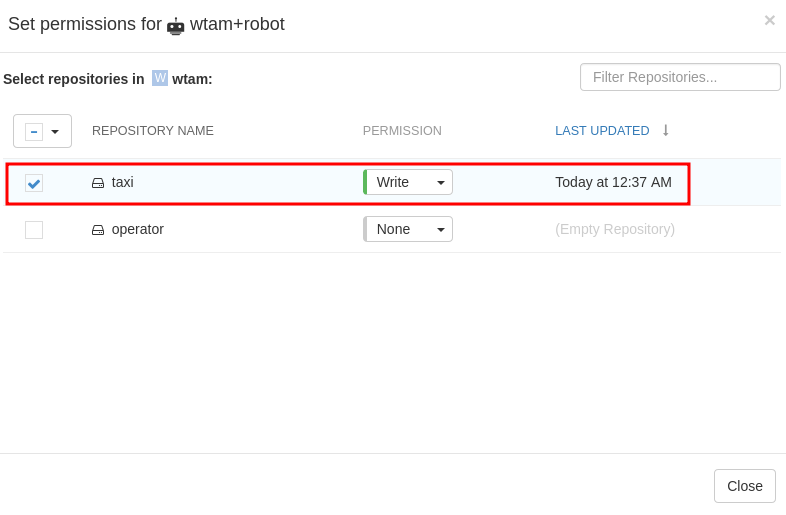
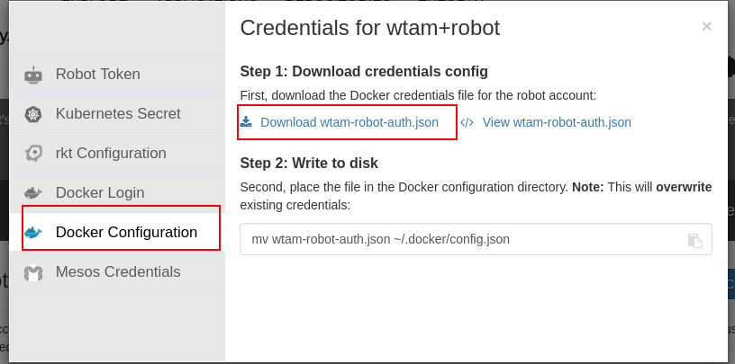

## Quay Credentials to push built image to Quay.io registry

Some of the Tasks in this Tutorial involve pushing images to Quay image registry.   (The image is to be built by CI Pipeline.)   Before we can start creating Kubernetes resources, we need to obtain credentials for your Quay user account.

 * Create `taxi` Quay repos. Login to your Quay.io account and create a repository `taxi`

 

 * Login to your Quay.io account that you can generate read/write credentials for.  In user's name pulldown menu, goto Account Settings -> Robot Account (button on the left).   Create a robot account for yourself.  Click your robot account link.

 

 * Select `Edit Repository Permissions` menu item

 

 * Grant `write` permission to repository `taxi`

 

 * Download Docker Configuration file to `<Quay user>-robot-auth.json`

 
