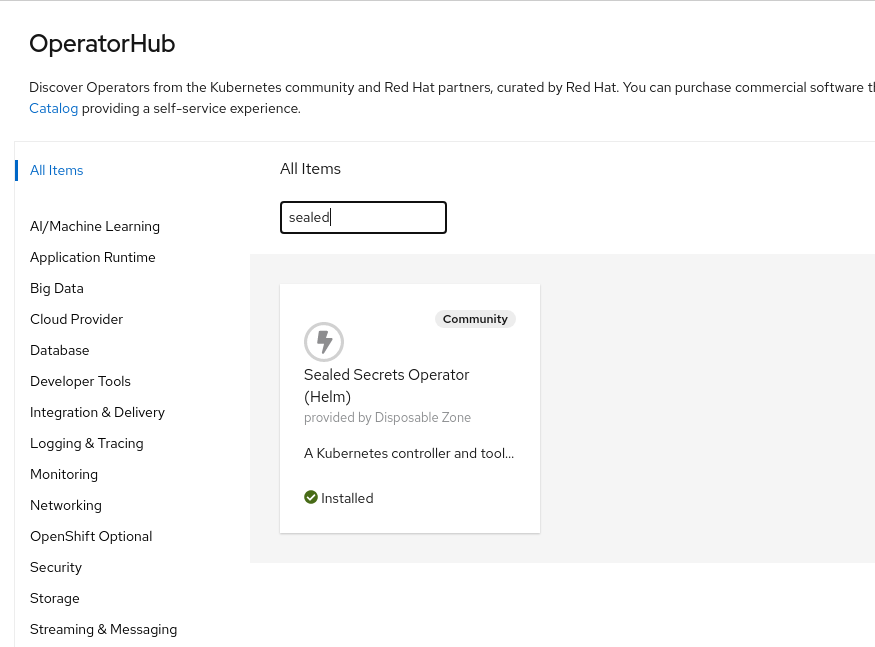
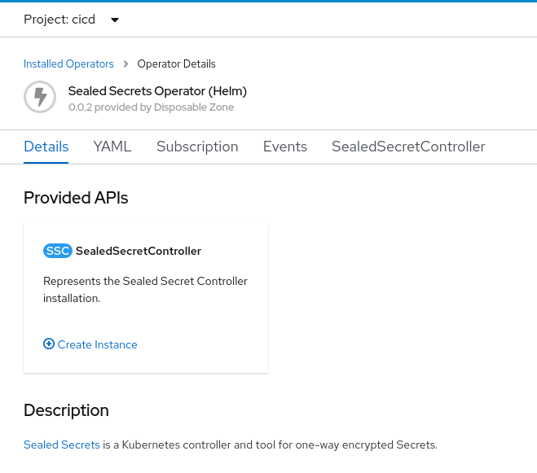

## Suggested approach

First, we need a cicd namespace:

```shell
$ oc create namespace cicd
```

Install the Sealed Secrets from the Operator Hub.



Then create a "SealedSecretController" instance in the "cicd" namespace.


