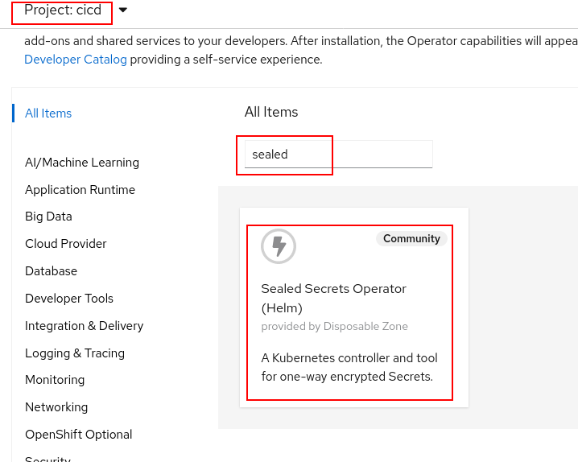
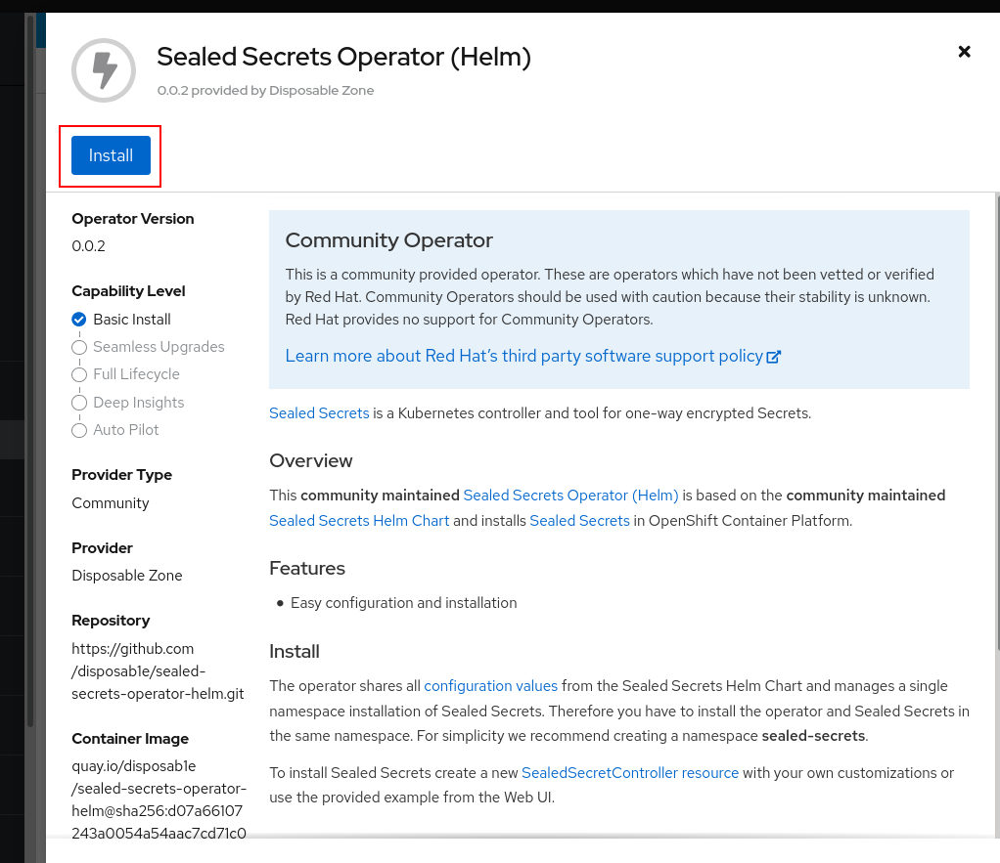
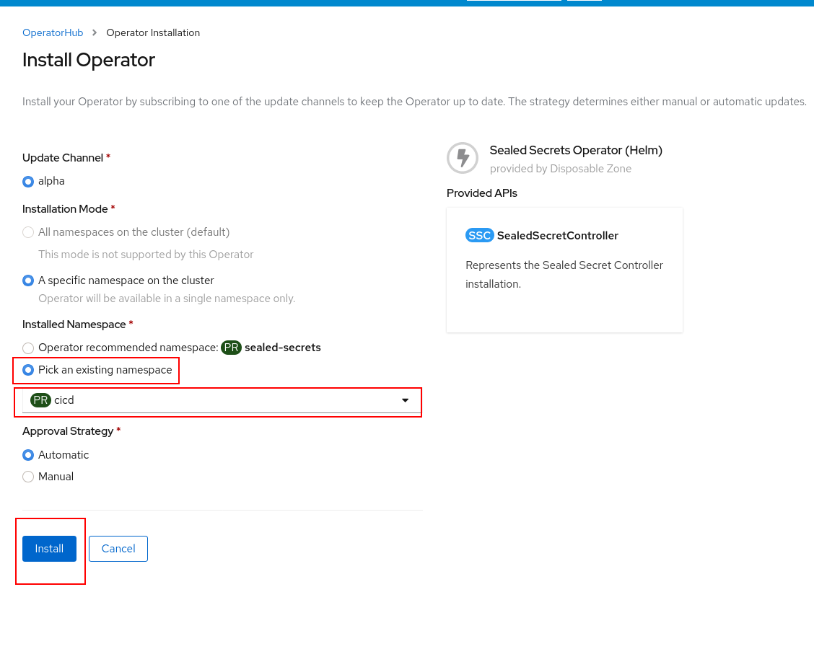
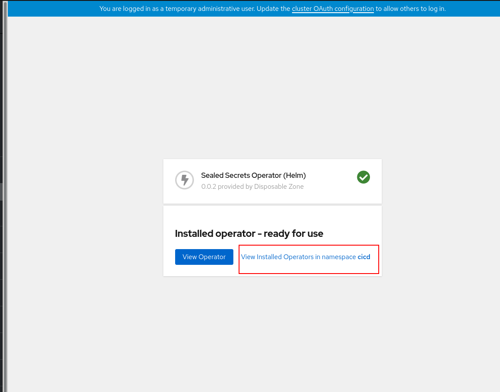
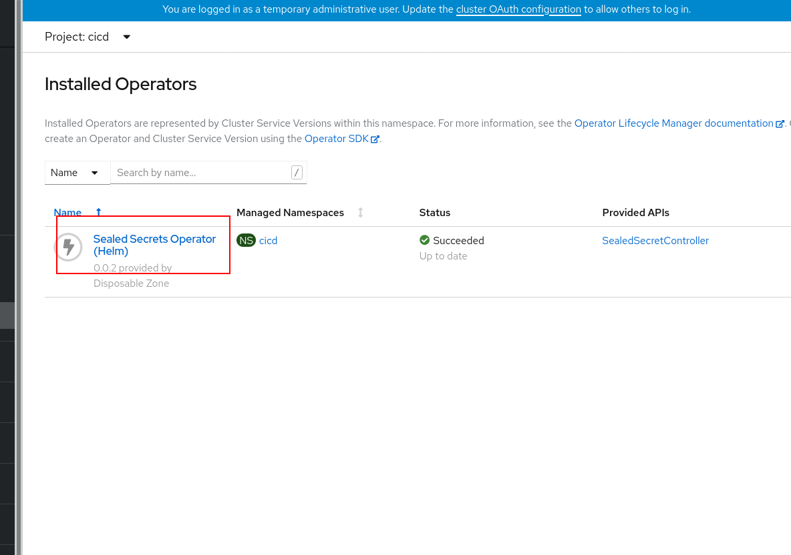
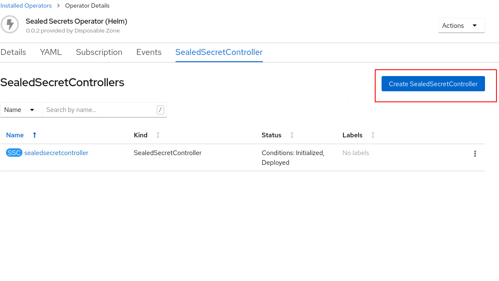
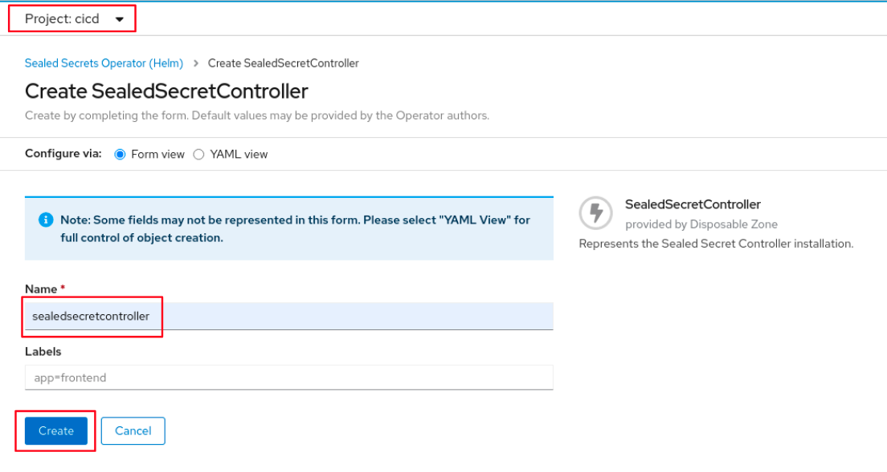
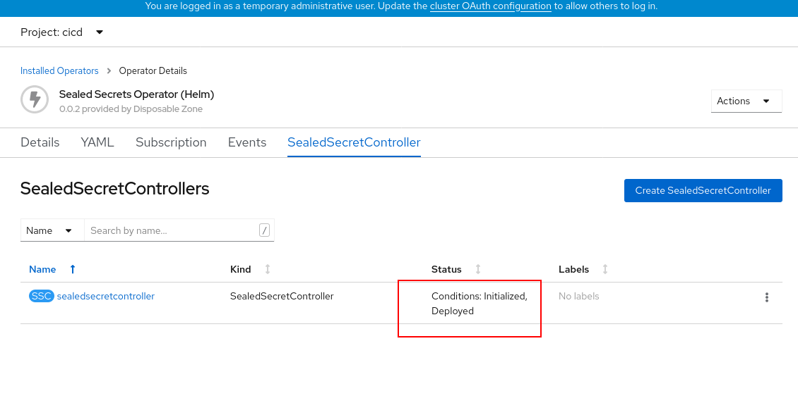

# Suggested approach

First, create a `cicd` namespace:

```shell
$ oc create namespace cicd
```

Install the Sealed Secrets Operator from the Operator Hub in the `cicd` namespace.










Then create a `SealedSecretController` instance in the `cicd` namespace.










