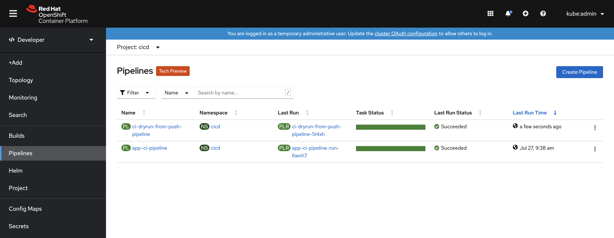
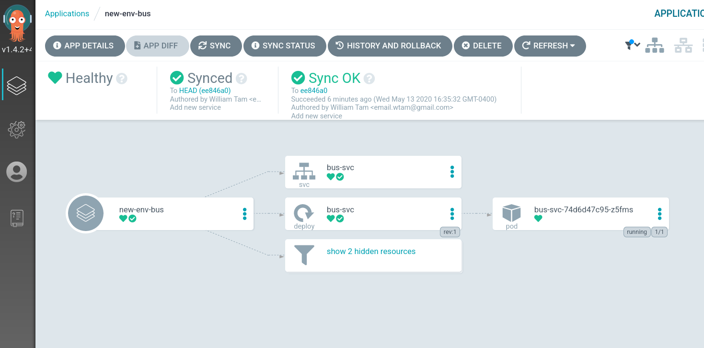
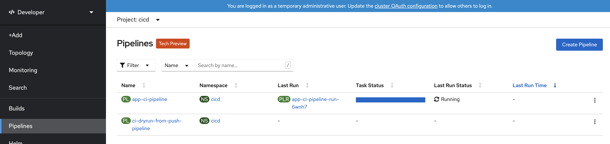

# Day 2 Operations

Day 2 Operations are actions that users take to change a GitOps system.

Currently, the following gitops commands are available to allow users to add new
Evnrionments and Applications/Services.

* [gitops environment](../../commands/environment)
* [gitops service](../../commands/service)
* [gitops webhook](../../commands/webhook)

## Prerequisites

* A GitOps system that has been bootstrapped in [Day 1 Operations](../day1)
* A new Git repository to be used as the new Service's source repository.
* Download official [gitops](https://github.com/redhat-developer/gitops-cli/releases/latest) binary

## Create a new Environment

To generate resources for a new Environment, you simiply run this command.

```shell
$ gitops environment add \
  --env-name new-env \
  --pipelines-folder <path to GitOps folder>
```

It adds a new Environment `new-env` in the Pipelines Model.

```yaml
environments:
- name: new-env
  pipelines:
    integration:
      bindings:
      - github-push-binding
      template: app-ci-template
```

And, it generates the following yamls.  The new resources are namespace and role bindings.

* [`environments/<env-name>/env/base/<env-name>-environment.yaml`](output/environments/new-env/env/base/new-env-environment.yaml)
* [`environments/<env-name>/env/base/<env-name>-rolebinding.yaml`](output/environments/new-env/env/base/new-env-rolebinding.yaml)

## Create an Application/Service in the new Environment

To generate resources for the new Service, run the foolowing command.

```shell
$ gitops service add \
  --env-name new-env \
  --app-name app-bus \
  --service-name bus \
  --git-repo-url http://github.com/<user>/bus.git \
  --pipelines-folder <path to GitOps file>
```


The `service add` command adds a new Service and Application under `new-env` Environment in the Pipelines Model as below.

```yaml
environments:
- apps:
  - name: app-bus
    services:
    - name: bus
      source_url: http://github.com/<user>/bus.git
      webhook:
        secret:
          name: webhook-secret-new-env-bus
          namespace: tst-cicd
  name: new-env
  pipelines:
    integration:
      bindings:
      - github-push-binding
      template: app-ci-template
```

In the Application's folder, a kustomization.yaml is generated to reference the new Service.

* [`environments/new-env/apps/app-bus/base/kustomization.yaml`](output/environments/new-env/apps/app-bus/base/kustomization.yaml)

In the Service's folder, an empty `config` folder is created.   This is the folder you will add `deployment yaml` files to specify how the Service should be deployed.

* [`environments/new-env/services/bus/base`](output/environments/new-env/services/bus/base)

Similar to the Day 1 example, we will just deploy a dummy nginxinc image.  The following files should be added to `config` folder.

* `100-deployment.yaml`

```yaml
apiVersion: apps/v1
kind: Deployment
metadata:
  creationTimestamp: null
  name: taxi
  namespace: new-env
spec:
  replicas: 1
  selector:
    matchLabels:
      app.kubernetes.io/name: bus
      app.kubernetes.io/part-of: app-bus
  strategy: {}
  template:
    metadata:
      creationTimestamp: null
      labels:
        app.kubernetes.io/name: bus
        app.kubernetes.io/part-of: app-bus
    spec:
      containers:
      - image: nginxinc/nginx-unprivileged:latest
        imagePullPolicy: Always
        name: bus
        ports:
        - containerPort: 8080
        resources: {}
      serviceAccountName: default
status: {}
```

* `200-service.yaml`
```yaml
apiVersion: v1
kind: Service
metadata:
  creationTimestamp: null
  labels:
    app.kubernetes.io/name: bus
    app.kubernetes.io/part-of: app-bus
  name: bus
  namespace: tst-dev
spec:
  ports:
  - name: http
    port: 8080
    protocol: TCP
    targetPort: 8080
  selector:
    app.kubernetes.io/name: bus
    app.kubernetes.io/part-of: app-bus
status:
  loadBalancer: {}
```

* `kustomization.yaml`

```yaml
resources:
- 100-deployment.yaml
- 200-service.yaml
```

The new Service/Application will be deployed by ArgoCD.   An ArgoCD application yaml is generated in the ArgoCD environment.

* [`config/argocd/config/<env>-<app>-app.yaml`](output/config/argocd/config/new-env-app-bus-app.yaml)

In the CI/CD Environment, a couple of resources are added or modified.

Webhook secret resource is generated.

* [`config/<prefix>-cicd/base/pipelines/03-secrets/webhook-secret-<env>-<service>.yaml`](output/config/tst-cicd/base/pipelines/03-secrets/webhook-secret-new-env-bus.yaml)

The Event Listener is modified as below to add a `trigger` for the new Service's source repository to trigger continous integration.

* [`config/<prefix>--cicd/base/pipelines/08-eventlisteners/cicd-event-listener.yaml`](output/config/tst-cicd/base/pipelines/08-eventlisteners/cicd-event-listener.yaml)

```yaml
  - bindings:
    - name: github-push-binding
    interceptors:
    - github:
        secretRef:
          namespace: tst-cicd
          secretKey: webhook-secret-key
          secretName: webhook-secret-new-env-bus
    - cel:
        filter: (header.match('X-GitHub-Event', 'push') && body.repository.full_name
          == 'wtam2018/bus')
        overlays:
        - expression: split(body.ref,'/')[2]
          key: ref
    name: app-ci-build-from-push-bus
    template:
      name: app-ci-template
```
## OC Apply Resources

Now, run `oc apply` to apply the generated resources to the cluster.

```shell
$ oc apply -k config/<prefix>-cicd/base
$ oc apply -k config/argocd/config/
$ oc apply -k environments/new-env/env/base/
```

## Create Webhook

Create a webhook for the new source repository.   This will allow webhook on the source repository to trigger CI Pipeline to run continuous integration on the new Service's source.

```shell
$ gitops webhook create \
    --access-token \
    --env-name new-env \
    --service-name bus \
    --pipelines-folder <path to GitOps folder>
```

## Commit and Push configuration to GitOps repoository

Next, we push all the new resources and configurations to GitOps Git repository.

```shell
$ git add .
$ git commit -m "Add new service"
$ git push origin master
```

CD Pipeline is triggered and run successfully.


New Application is deployed by ArgoCD successfully.


Make a change to your application source, the `bus` repo from the example, it
can be as simple as editing the `README.md` and propose a change as a
Pull Request.

This should trigger the PipelineRun:


