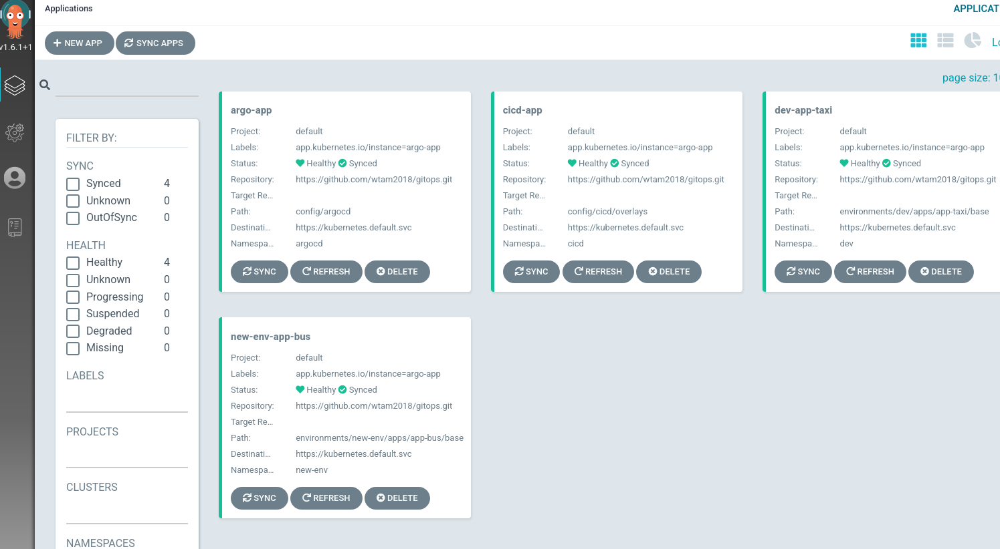

# Day 2 Operations

Day 2 Operations are actions that users take to change a GitOps system.

Currently, the following gitops commands are available to allow users to add new
Evnrionments and Applications/Services.

* [kam environment](../../commands/kam_environment.md)
* [kam service](../../commands/kam_service.md)
* [kam webhook](../../commands/kam_webhook.md)

## Prerequisites

* A kam system that has been bootstrapped in [Day 1 Operations](../day1)
* A new Git repository to be used as the new Service's source repository.
* Download official [kam](https://github.com/redhat-developer/kam/releases/latest) binary

## Create a new Environment

To generate resources for a new Environment, you simply run this command:

```shell
$ kam environment add \
  --env-name new-env \
  --pipelines-folder <path to GitOps folder>
```

This will add a new Environment `new-env` in the Pipelines Model:

```yaml
environments:
- name: new-env
  pipelines:
    integration:
      bindings:
      - github-push-binding
      template: app-ci-template
```

And, it generates the following yamls.  The new resources are namespace and role bindings.

* `environments/<env-name>/env/base/<env-name>-environment.yaml`

## Create an Application/Service in the new Environment

To generate resources for the new Service, run the following command:

```shell
$ kam service add \
  --env-name new-env \
  --app-name app-bus \
  --service-name bus \
  --git-repo-url http://github.com/<your organization>/bus.git \
  --pipelines-folder <path to GitOps file>
```

The `service add` command adds a new Service and Application under `new-env` Environment in the Pipelines Model as below:

```yaml
environments:
- apps:
  - name: app-bus
    services:
    - name: bus
      source_url: http://github.com/<your organization>/bus.git
      webhook:
        secret:
          name: webhook-secret-new-env-bus
          namespace: cicd
  name: new-env
  pipelines:
    integration:
      bindings:
      - github-push-binding
      template: app-ci-template
```

In the Application's folder, a kustomization.yaml is generated to reference the new Service.

* `environments/new-env/apps/app-bus/services/bus/base/kustomization.yaml`

In the Service's base folder, an empty `config` folder is created. This is the folder in which you will add `deployment yaml` files to specify how the Service should be deployed.

* `environments/new-env/apps/app-bus/services/bus/base/config`

Similar to the Day 1 example, we will just deploy a dummy nginxinc image.  The following files should be added to `config` folder:

* `100-deployment.yaml`

```yaml
apiVersion: apps/v1
kind: Deployment
metadata:
  creationTimestamp: null
  name: bus
  namespace: new-env
spec:
  replicas: 1
  selector:
    matchLabels:
      app.kubernetes.io/name: bus
      app.kubernetes.io/part-of: app-bus
  strategy: {}
  template:
    metadata:
      creationTimestamp: null
      labels:
        app.kubernetes.io/name: bus
        app.kubernetes.io/part-of: app-bus
    spec:
      containers:
      - image: nginxinc/nginx-unprivileged:latest
        imagePullPolicy: Always
        name: bus
        ports:
        - containerPort: 8080
        resources: {}
      serviceAccountName: default
status: {}
```

* `200-service.yaml`
```yaml
apiVersion: v1
kind: Service
metadata:
  creationTimestamp: null
  labels:
    app.kubernetes.io/name: bus
    app.kubernetes.io/part-of: app-bus
  name: bus
  namespace: dev
spec:
  ports:
  - name: http
    port: 8080
    protocol: TCP
    targetPort: 8080
  selector:
    app.kubernetes.io/name: bus
    app.kubernetes.io/part-of: app-bus
status:
  loadBalancer: {}
```

* `kustomization.yaml`

```yaml
resources:
- 100-deployment.yaml
- 200-service.yaml
```

The new Service/Application will be deployed by ArgoCD. An ArgoCD application yaml is generated in the ArgoCD environment:

* `config/argocd/<env>-<app>-app.yaml`

In the CI/CD Environment, a couple of resources are added or modified.

A Webhook secret resource is generated:

* `config/cicd/base/03-secrets/webhook-secret-<env>-<service>.yaml`

The Event Listener is modified as below to add a `trigger` for the new Service's source repository to trigger continous integration:

* `config/cicd/base/08-eventlisteners/cicd-event-listener.yaml`

```yaml
  - bindings:
    - name: github-push-binding
    interceptors:
    - github:
        secretRef:
          namespace: tst-cicd
          secretKey: webhook-secret-key
          secretName: webhook-secret-new-env-bus
    - cel:
        filter: (header.match('X-GitHub-Event', 'push') && body.repository.full_name
          == 'wtam2018/bus')
        overlays:
        - expression: split(body.ref,'/')[2]
          key: ref
    name: app-ci-build-from-push-bus
    template:
      name: app-ci-template
```
## Commit and Push configuration to GitOps repoository

Now, you can push changes to your gitops repository:

```shell
$ git add .
$ git commit -m "Add new service"
$ git push origin master
```
ArgoCD will automatically apply changes to the cluster and deploys your new service. Pretty neat!


## Create Webhook

Create a webhook for the new source repository. This will allow a webhook configured on the source repository to trigger CI Pipeline to run continuous integration on the new Service's source:

```shell
$ kam webhook create \
    --git-host-access-token <git host access token> \
    --env-name new-env \
    --service-name bus \
    --pipelines-folder <path to GitOps folder>
```
	
* When a token is not provided in the webhook command flag `--git-host-access-token`, the token is retrieved from the keyring using the `hostname of the URL` as the username and service name `kam`. If no token found in the keyring, a token is retrieved from environment variable as described in the step below.	

* When a token is not provided in command flag and the token is not present in the keyring, the webhook cmd will look for the access token in an environment variable with the syntax `<HOSTNAME>_TOKEN` (e.g. `GITHUB_COM_TOKEN`). The environment variable name is assigned as follows: The hostname (e.g. github.com) is extracted from the value passed to the repository URL (e.g. `https://github.com/username/repo.git`), where any dot (`.`) in the hostname is replaced by an underscore (`_`) and concatenated with `_TOKEN`. Considering the previous examples, the environment varaible name will be `GITHUB_COM_TOKEN`.

Assuming the token is not passed in the command, if the token is not found in the keyring or the environment variable with the specified name, the command will fail.

Make some modifications to the new application source repository and raise a PR.

CD Pipeline is triggered and run successfully.


New Application is deployed by ArgoCD successfully.


Make a change to your application source, the `bus` repo from the example, it
can be as simple as editing the `README.md` and propose a change as a
Pull Request.

This should trigger the PipelineRun:


