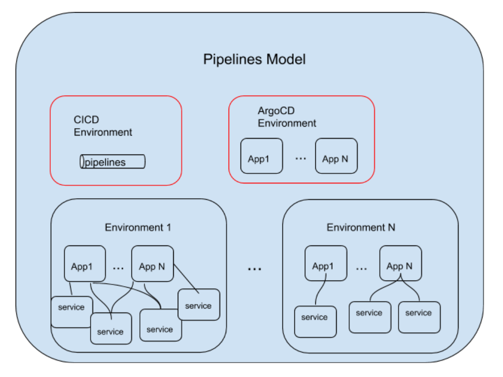

# Pipelines Model (aka Manifest)

The Pipelines Model represents an inventory of _Environments_, _Applications_ and _Services_ within a GitOps setup.  This model allows tools to perform operations on GitOps setup without the needs for querying cluster resources which is often hard if not impossible to do.  The actual execution of operations is driven by Git PullRequests.  In other words, tools generate or update resources to be pushed to Git.

Within a GitOps setup, there can be many [Environments](#Environment), [Applications](#Application), and [Services](#Service).  The following diagram shows the structure of the Pipelines Model.



Pipelines Model is defined in a yaml file.  Here is an example pipelines.yaml

```yaml
config:
  argocd:
    namespace: argocd
  pipelines:
    name: cicd
environments:
- apps:
  - name: app-taxi
    services:
    - name: taxi
      pipelines:
        integration:
          bindings:
          - dev-app-taxi-taxi-binding
          - gitlab-push-binding
      source_url: https://gitlab.com/rhd-example-gitops/taxi.git
      webhook:
        secret:
          name: webhook-secret-dev-taxi
          namespace: cicd
  name: dev
  pipelines:
    integration:
      bindings:
      - gitlab-push-binding
      template: app-ci-template
- name: stage
gitops_url: https://github.com/<your organization>/<your repository>
```

## Environment

There are three types of Environments
* CI/CD Environment
* ArgoCD Environment
* (Plain old) Environment

### CI/CD Environment

The CI/CD Environment is a special Environment that contains CI/CD pipelines.  These pipelines respond to changes in GitOps configuration repository and Application/Service soruce repositories.  They are responisble for keeping the resources in the cluster in-sync with the configurations in Git and re-build/re-deploy application/service images.

### ArgoCD Environment

ArgoCD is used to perform Continuous Delivery of Applications.  When an Application is created in the target Environment an ArgoCD application is also created and kept in the ArgoCD Environment.  The user is reponsible for creating deployment.yaml in the "config" folder for the application.  ArgoCD will deploy the application based on the user-provided deployment specification and re-deploy it automatically when the specification is changed.

### (Plain Old) Enviroment

Within a Pipelines Model, there are many Environments which hold Applications and Services.  Each Environment has its own namespace.

## Application

An Application is a logical grouping of Services.  It contains references to Services.  When an Application is deployed, all referenced Services are deployed.  Two Applications can reference to a same Service.  Each Application can have specific customization to the Service it references/deploys.  A Service is not intendedto  be deployed by itself (without an Application).

## Service

A Service can have a source repository and an image repository.  Services are unique within an Environment.  However, no two Services can share a same source Git reposiotry even though they belong to different Environments.

## GitOps Repository

A GitOps repository is just a Git repository organized to be used with GitOps tools. It organizes the Environments, Applications, and Services with any customization necessary for deployment.

Different Environments are stored in different directories under the `environments/` directory in the GitOps repository. Configuration in is then separated into layers reflected by these sub-directories:

- `env/` - Configuration specific to the namespace / Environment.
- `apps/*` - Configuration folders specific to each Application.
- `services/*` - Configuration folders specific to each Service.

Each configuration directory will contain Kustomization files structured like this:

```
.
├── base
│   ├── *.yaml
│   └── kustomization.yaml
└── overlays
    ├── *.yaml
    └── kustomization.yaml
```

Each Service is defined in its `.../services/<service-name>/base/` directory in various YAML files, and its `overlays/` directory includes more specific details such as pod scaling and environment variables. The configuration of each service can be maintained by just a development team, and should be individually deployable with a `kubectl apply -k ` command, which allows for quick testing.

Each Application’s `.../apps/<app-name>/base/kustomization.yaml` will refer to each Service which it uses. Again, the `overlays/` directory will include new specific configuration files required for the application, for example new labels or other details to connect the services. 

Finally, the `.../env/base/kustomization.yaml` will refer to each application which is to be deployed in the environment, and the `env/overlays/` directory will contain any specifics required for the environment. For example, details about service accounts and specific Ingress URLs could be specified here. It will also have a `.../env/kustomization.yaml` file so that the fully-configured applications can be deployed into the environment with this command:

```shell
$ oc apply -k environments/<env-name>/env/
```
